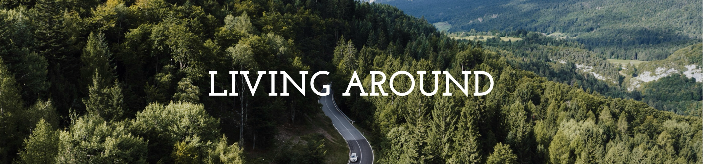

**Living Around** is a visually appealing and responsive travel-focused website featuring accommodation details, local highlights, and a contact page. Built using **HTML, CSS, Bootstrap 5, and JavaScript**, it offers smooth navigation and a dynamic user interface.

## Features

- Hero section with background image and smooth scroll
- Interactive map section on the "Locais" page
- Accommodation cards with modals for more details
- Static blog page
- Contact form layout
- Fully responsive design for mobile and desktop
- Dynamic navbar that changes appearance on scroll

## Technologies Used

- HTML5  
- CSS3  
- JavaScript  
- Bootstrap 5  
- Google Fonts  

## What I Learned

This project helped me strengthen my skills in:
- Using Bootstrap utility classes effectively
- Creating dynamic navigation bars that respond to scroll events
- Developing responsive layouts with Bootstrap and media queries
- Writing clean and semantic HTML and CSS
- Managing visual state changes using JavaScript

## Live Demo

-> <a href="https://laisvigas.github.io/Living-Around/pages/index.html" target="_blank">Access the project here</a> <-

